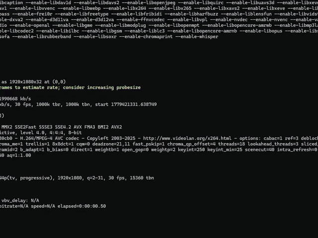

# λ Calcolo — Guida Interattiva

> Una pagina web interattiva che spiega il Lambda Calcolo attraverso codice JavaScript eseguibile, con un'interfaccia ispirata ai monitor a fosfori verdi dei computer degli anni '80 e '90.

---

## 📺 Demo

**Demo Online:** Prova la versione live qui: [https://lambda.darioros.it](https://lambda.darioros.it/)

---

## 📚 Concetti trattati

| Concetto | Categoria | Descrizione sintetica |
|---|---|---|
| **Astrazione Lambda** | base | Funzione anonima `λx. expr` → `x => expr` in JS |
| **Applicazione** | base | Applicare una funzione a un argomento `(f a)` |
| **Currying** | core | Funzioni multi-argomento come catene di funzioni |
| **β-Riduzione** | core | La regola di calcolo fondamentale del sistema |
| **Numeri di Church** | numeri | Interi codificati come funzioni pure |
| **Addizione e Moltiplicazione** | numeri | Aritmetica come composizione di funzioni |
| **Booleani di Church** | logica | `true`/`false` come selettori funzionali |
| **Coppie (Pair)** | strutture | Strutture dati come chiusure |
| **Predecessore e Sottrazione** | numeri | Il trucco delle coppie scorrevoli |
| **Combinatore Y** | avanzato | Ricorsione senza self-reference |

---

## 🔧 Dipendenze CDN

| Libreria | Versione | Utilizzo |
|---|---|---|
| [Prism.js](https://prismjs.com/) | 1.29.0 | Syntax highlighting del codice JS |
| [VT323](https://fonts.google.com/specimen/VT323) | — | Font display stile terminale |
| [Share Tech Mono](https://fonts.google.com/specimen/Share+Tech+Mono) | — | Font monospace per testo e codice |

---

## 🧠 Riferimenti teorici

- Church, A. (1936). *An Unsolvable Problem of Elementary Number Theory*. American Journal of Mathematics.
- Barendregt, H. (1984). *The Lambda Calculus: Its Syntax and Semantics*. North-Holland.
- [Wikipedia — Lambda calculus](https://en.wikipedia.org/wiki/Lambda_calculus)
- [Wikipedia — Church encoding](https://en.wikipedia.org/wiki/Church_encoding)
